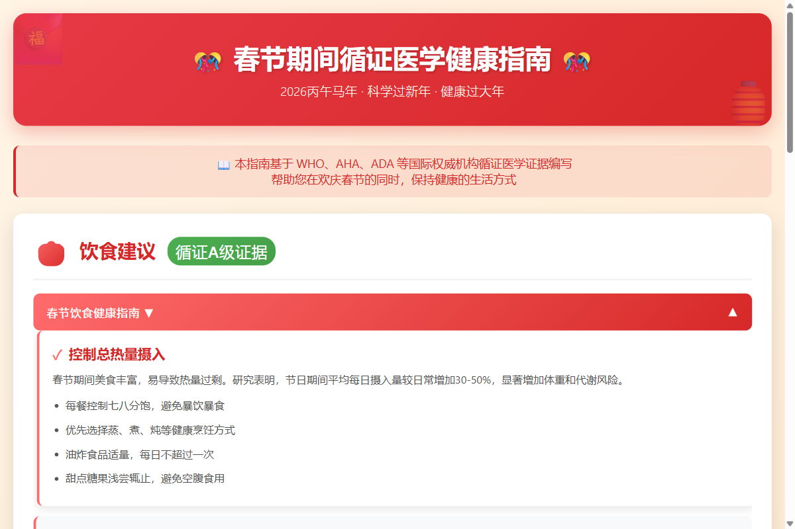

# 🎊 春节期间循证医学健康指南

> 基于国际权威机构循证医学证据的春节健康指导网页

## 📖 项目简介

这是一个春节期间循证医学健康指南网页，帮助大家在欢庆春节的同时保持健康的生活方式。项目基于 WHO、AHA、ADA 等国际权威机构循证医学证据编写，涵盖饮食、饮酒、用药、慢性病管理等全方位健康指导。

## ✨ 功能特点

- 🎨 **春节主题设计**：红色渐变配色，融入红包、灯笼等节日元素
- 📊 **6大健康模块**：饮食、饮酒、用药、高血压、糖尿病、急症处理
- 🏥 **循证医学依据**：基于国际权威机构指南
- 📱 **响应式设计**：支持桌面和移动设备
- 🎯 **实用性强**：提供具体的数值标准和操作建议
- 🎭 **交互友好**：手风琴折叠效果，单选模式，平滑动画

## 🚀 快速开始

### 环境要求

- 现代浏览器（Chrome、Firefox、Safari、Edge 等）
- 无需任何依赖或服务器

### 使用方法

1. 克隆或下载本项目
2. 用浏览器打开 `index.html` 文件
3. 开始浏览春节健康指南

```bash
# 直接打开（推荐）
start index.html

# 或者使用 Python 启动本地服务器
python -m http.server 8000
# 然后访问 http://localhost:8000
```

## 📁 项目结构

```
iflow/
├── index.html                          # 主页面（包含 HTML/CSS/JS）
├── spring-festival-health-guide.png    # 项目截图
├── 论坛发帖文案.md                      # 论坛发帖文档
├── iflow.md                            # 活动要求文档
└── README.md                           # 项目说明文档（本文件）
```

## 🏥 循证医学依据

本指南内容基于以下国际权威机构指南：

- **饮食建议**：《中国居民膳食指南(2022)》、WHO 指南
- **饮酒安全**：《中国居民膳食指南(2022)》、AHA 建议
- **用药安全**：临床药学指南
- **高血压管理**：AHA/ACC 指南
- **糖尿病管理**：ADA（美国糖尿病协会）指南
- **急症处理**：国际急救指南

## 📸 截图展示



**页面整体效果：**
- 🎨 春节主题红色渐变设计，融入红包、灯笼等节日元素
- 📖 清晰的页面结构：标题横幅 → 说明区域 → 6大健康模块
- 🟢 "循证A级证据"绿色徽章突出权威性
- ✓ 每个内容项带红色对勾，视觉清晰

## 🎯 技术栈

- **HTML5**：页面结构
- **CSS3**：样式和动画效果
- **原生 JavaScript**：交互功能（无需依赖外部库）
- **响应式设计**：兼容桌面和移动设备

## 🛠️ 核心功能

### 1. 饮食建议
- 控制总热量摄入
- 蔬菜水果摄入标准
- 避免高脂高糖食物
- 规律饮食建议

### 2. 饮酒安全
- 酒精摄入量限制
- 特殊人群饮酒禁忌
- 酒后注意事项
- 酒精与药物相互作用

### 3. 用药安全
- 节日期间用药提醒
- 药物相互作用
- 特殊人群用药注意事项
- 应急药物准备

### 4. 高血压管理
- 血压监测频率
- 节日期间饮食控制
- 情绪管理建议
- 突发情况处理

### 5. 糖尿病管理
- 血糖监测要点
- 节日饮食原则
- 运动建议
- 低血糖处理

### 6. 急症处理
- 心脏急症识别
- 中风预警信号
- 食物中毒处理
- 紧急联系方式

## 📱 响应式设计

本指南采用响应式设计，支持多种设备：
- 💻 桌面设备（1200px+）
- 📱 平板设备（768px - 1199px）
- 📲 移动设备（< 768px）

## ⚠️ 免责声明

本指南仅供健康科普参考，不能替代专业医疗建议。如遇健康问题，请及时就医或咨询专业医师。

## 📄 许可证

本项目采用 MIT 许可证。

## 🤝 贡献

欢迎提交 Issue 和 Pull Request！

## 📮 联系方式

如有问题或建议，欢迎通过以下方式联系：

- 提交 Issue
- 发送邮件

---

*祝您春节快乐，身体健康！🎊🧧*